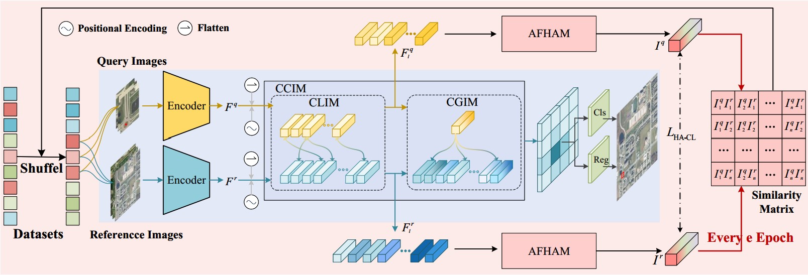

# HALO: Hierarchical Adaptive Feature Learning and Cross-View Interaction for Object-level Geo-Localization

### Abstract
Cross-view object localization (CVOGL) offers fine-grained geographic information regarding the specified object of interest, in comparison to typical cross-view geo-location at the image level.
However, it faces more challenges, primarily due to significant visual appearance changes induced by viewpoint discrepancies and the difficulty of accurately identifying corresponding objects within reference images containing multiple targets. To address these challenges, we propose a novel CVOGL model termed \modelname. First, we introduce a cascade cross-view feature interaction module that enables effective local-to-global feature fusion across different viewpoints, thereby enhancing the feature representation of objects in the reference image. Second, to mitigate the scale variations and feature distribution discrepancies between the query and reference images, we propose an adaptive feature hierarchization and aggregate module. It extracts more representative global descriptors by adaptively hierarchizing and aggregating features. Lastly, utilizing the learned global descriptors, we perform cross-view CL and introduce a hard sample mining strategy to further enhance the discriminative ability of the network. Through these advancements, we significantly improve the discriminative representations of the query objects at both views.



CVOGL is a dataset that comprises ground-view images, drone aerial-view images, and satellite-view images.

The download link is  [CVOGL](https://drive.google.com/file/d/1WCwnK_rrU--ZOIQtmaKdR0TXcmtzU4cf/view?usp=sharing) 


# Train

1. Firstly, download CVOGL and rename it to 'data', i.e., 'data/CVOGL_DroneAerial' and 'data/CVOGL_SVI'.
2. Secondly, download the pretrained Yolov3 model and LSK model and place it in the 'saved_models' directory.
3. Thirdly, execute 'scripts/run_train_all.sh', 'scripts/run_train_droneaerial.sh', or 'scripts/run_train_svi.sh' to train the models.
```
sh scripts/run_train_all.sh
# sh scripts/run_train_droneaerial.sh
# sh scripts/run_train_svi.sh
```

# Test
```
sh run_test_all.sh
# sh run_test_droneaerial.sh
# sh run_test_svi.sh
```

# Citation


